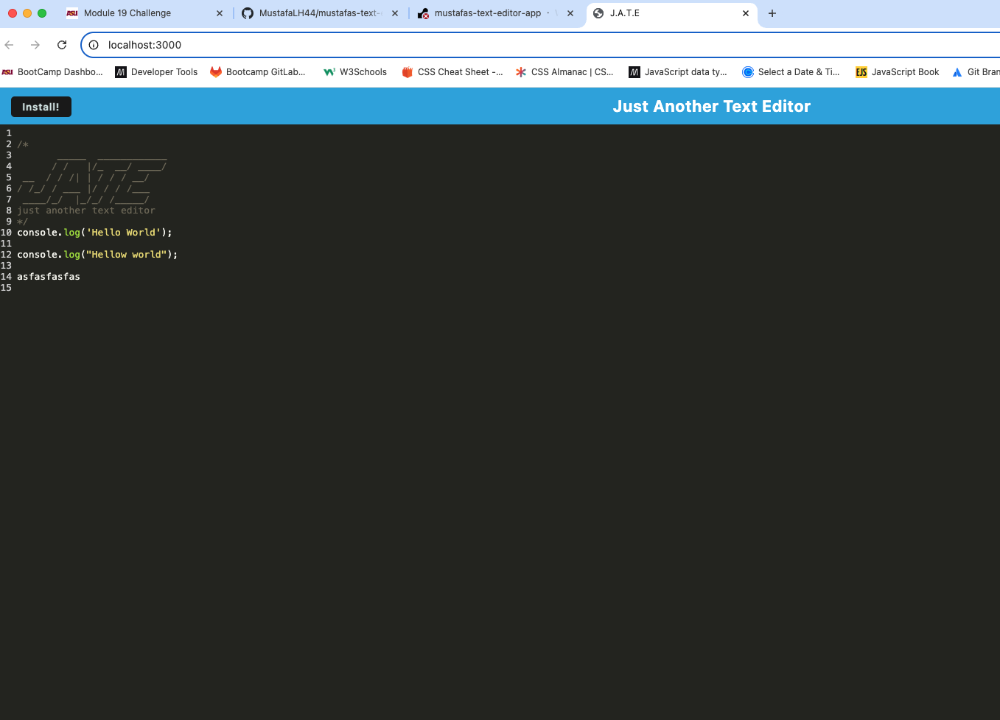
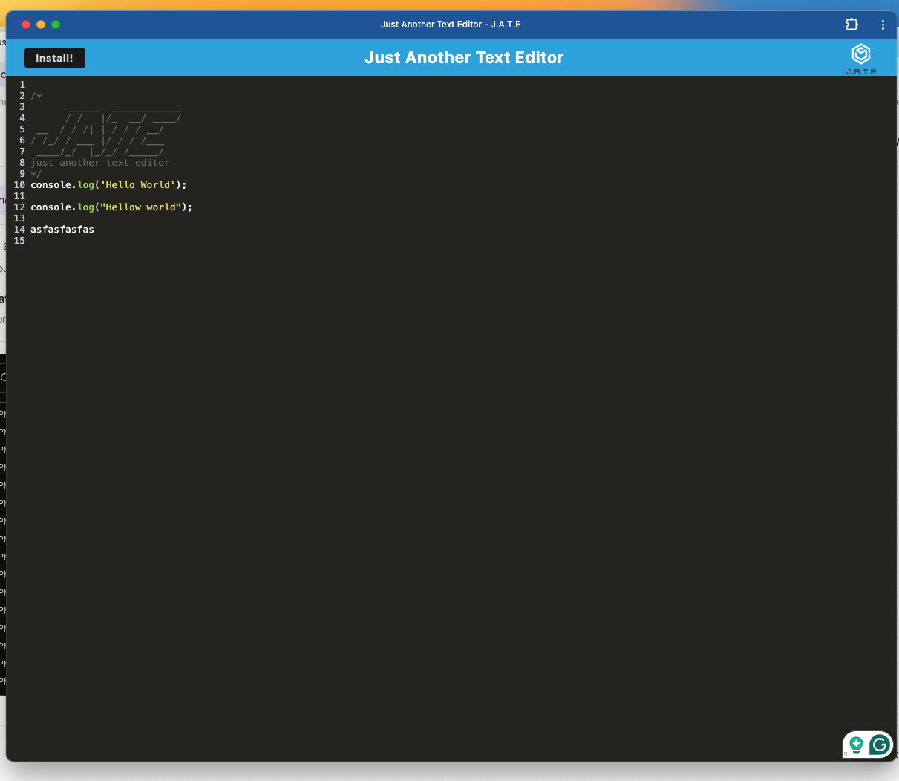

# mustafas-text-editor-app

## User Story

Given a text editor web application, when I open the application in my editor, then I should see a client-server folder structure.
When I run npm run start from the root directory, then the application should start up both the backend and serve the client.
When I run the text editor application from my terminal, then I should find that my JavaScript files have been bundled using Webpack.
When I run my Webpack plugins, then I should find that an HTML file, service worker, and manifest file have been generated.
When I use next-gen JavaScript in my application, then the text editor should still function in the browser without errors.
When I open the text editor, then IndexedDB should immediately create a database storage.
When I enter content and subsequently click off of the DOM window, then the content in the text editor should be saved using IndexedDB.
When I reopen the text editor after closing it, then the content in the text editor should be retrieved from IndexedDB.
When I click on the Install button, then I should be able to download the web application as an icon on my desktop.
When I load the web application, then a service worker should be registered using Workbox.
When I register a service worker, then my static assets should be pre-cached upon loading, along with subsequent pages and static assets.
When I deploy the application to Render, then I should have proper build scripts for a Webpack application.

## Mock-Up

## Live-Application
https://mustafas-text-editor-app.onrender.com